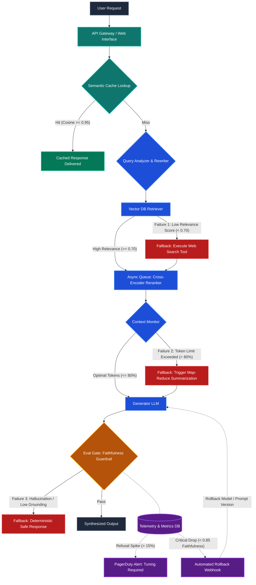
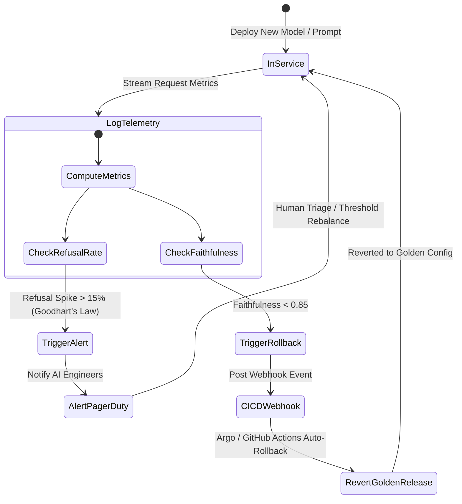

# Advanced Architecture Specification: Resilient Enterprise RAG System

This document outlines the engineering specifications, failure mode analysis, scalability bottlenecks, and automated evaluation-driven deployment controls for the Day 8 architecture deliverable.

---

## 1. System Topology Overview

The system implements a production-grade multi-stage Retrieval-Augmented Generation (RAG) pipeline designed for low-latency queries, strict factual grounding, and graceful failure recovery under high traffic loads.

---

## 2. Failure Points & Explicit Fallback Mechanisms

### Failure Point 1: Retriever Failure (Low Relevance / Empty Set)
* **Detection Trigger:**
  The vector database (e.g., Pinecone, Qdrant, pgvector) executes an Approximate Nearest Neighbor (ANN) search using Cosine distance. If the maximum similarity score among retrieved chunks satisfies $\max(\text{score}) < 0.70$, or if the result set is null (empty), a `LowRelevanceException` is raised.
* **Impact Without Fallback:**
  The model generates answers based on irrelevant context chunks, inducing high-confidence hallucinations or empty evasions.
* **Explicit Fallback Mechanism:**
  1. The pipeline branches into an **External Tool Agent** (e.g., SerpAPI / Google Search / Tavily).
  2. The rewritten query is dispatched to obtain the top 5 authoritative web results.
  3. Content is parsed, stripped of boilerplate HTML, chunked dynamically, and embedded on-the-fly.
  4. The web-derived chunks are injected directly into the reranking queue, maintaining session continuity.

### Failure Point 2: Context Window Overflow
* **Detection Trigger:**
  A pre-generation middleware counts total tokens (system prompt + multi-turn history + retrieved context chunks). If:
  $$\frac{\text{Total Tokens}}{\text{Model Context Limit}} > 0.80$$
  the payload triggers a `ContextOverflowWarning`.
* **Impact Without Fallback:**
  Generation fails due to API token limit crashes (HTTP 400 Bad Request), or unmanaged truncation cuts off critical context and instructions.
* **Explicit Fallback Mechanism:**
  1. The pipeline redirects context chunks to a fast, low-cost model (e.g., Gemini Flash / Claude Haiku).
  2. A **Hierarchical Map-Reduce Summarization** is executed:
     - **Map Phase:** Each chunk is summarized into key factual propositions linked to original chunk IDs.
     - **Reduce Phase:** Proposition sets are consolidated into dense bulleted summaries, achieving a 60–75% reduction in token count while preserving factual density.
  3. The compressed context is returned to the main generator.

### Failure Point 3: Eval Gate Rejection (Hallucination / Low Grounding)
* **Detection Trigger:**
  The draft response is evaluated inline by an automated **Faithfulness Guardrail** (a calibrated NLI Judge / Ragas metric). Each assertion in the candidate response is evaluated against the provided context:
  $$\text{Faithfulness} = \frac{|\text{Supported Claims}|}{|\text{Total Claims Extracted}|}$$
  If $\text{Faithfulness} < 0.85$, the gate triggers an immediate rejection.
* **Impact Without Fallback:**
  False or misleading statements are delivered to users, compromising system trustworthiness and regulatory compliance.
* **Explicit Fallback Mechanism:**
  1. The generated draft is dropped and logged to an audit quarantine pool.
  2. The user receives a pre-approved, deterministic safe message:
     > *"I cannot verify this information based on the available data."*
  3. The query and failed draft are asynchronously dispatched to an offline evaluation queue for RLHF/fine-tuning analysis.

---

## 3. Scaling Consideration: The Reranker Bottleneck

### The Bottleneck: Cross-Encoder Reranker
While bi-encoders generate vector embeddings independently for sub-millisecond similarity checks, a **Cross-Encoder Reranker** (e.g., `bge-reranker-large`, `ms-marco-MiniLM-L-12-v2`) requires concatenating query and document into a single sequence and executing full bidirectional cross-attention:
$$\mathcal{O}(K \cdot L^2)$$
where $K$ is the number of candidate documents and $L$ is the concatenated token length.

At 500 QPS with $K=50$ candidates, the system must process 25,000 deep transformer inferences per second. This immediately:
1. Saturates GPU tensor cores and VRAM.
2. Exhausts Python asyncio event loops due to CPU/GPU synchronization barriers.
3. Causes P99 latency to spike from $\approx 250\text{ms}$ to $> 4.5\text{s}$.

### Resolution & Architectural Mitigation
1. **Asynchronous Decoupled Worker Queue:**
   - Remove the reranker from the synchronous web API thread.
   - Dispatch candidate sets to an async Redis/RabbitMQ queue consumed by a cluster of dedicated GPU worker nodes.
   - Utilize **KEDA (Kubernetes Event-driven Autoscaling)** to dynamically scale worker pods based on queue length.
2. **Semantic Front-End Caching:**
   - Place a **Redis / GPTCache** semantic cache at the API Gateway.
   - Incoming queries are vectorized and compared against cached queries. For matches with Cosine Similarity $\ge 0.95$, the final answer is served immediately ($< 15\text{ms}$), bypassing the retriever, reranker, and LLM entirely.
3. **Two-Stage Cascading Filtration:**
   - Use BM25 or lightweight embeddings to prune the initial 100 retrieved candidates down to 15 high-confidence candidates before executing the Cross-Encoder.

---

## 4. Evaluation Integration: Automated Alerts & Rollbacks

### Alerting Pipeline: Preventing Goodhart's Law
* **Problem:** If guardrails are set too aggressively, the LLM rejects benign queries to preserve high faithfulness scores.
* **Mechanism:** Telemetry streams real-time sliding windows (15 minutes). If the **Refusal Rate** spikes $> 15\%$ while Faithfulness is $\approx 1.0$, an automated P1 alert triggers via PagerDuty/Opsgenie to alert prompt engineers that the system has entered an over-defensive failure state.

### Automated Rollback Pipeline: Zero-Downtime Quality Protection
* **Problem:** A newly deployed system prompt or fine-tuned model checkpoint introduces subtle reasoning regressions.
* **Mechanism:**
  1. The Eval Gate continuously updates a running 100-request moving average of the **Faithfulness Score**.
  2. If the score degrades below the SLA floor of **0.85**, a secure webhook triggers the CI/CD deployment orchestrator (GitHub Actions / Argo Rollouts / Spinnaker).
  3. The orchestrator immediately shifts traffic back to the **Golden Model / Prompt Template** version.
  4. The failing deployment is automatically cordoned, and the offending prompt-response pairs are exported to S3 for regression unit test generation.
