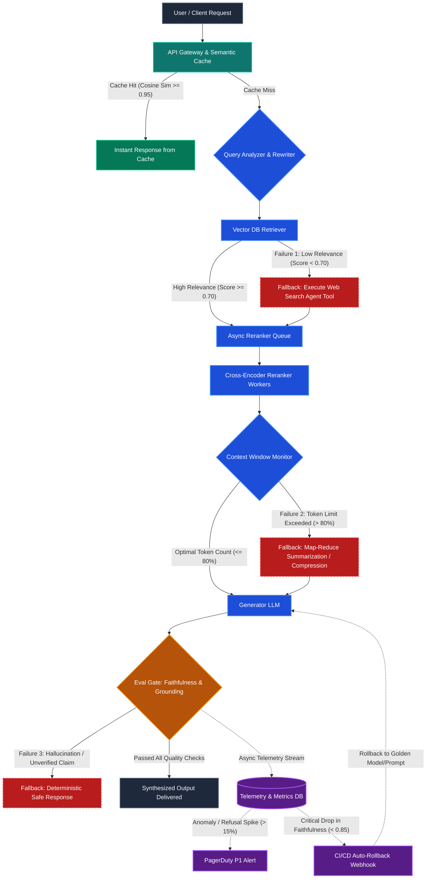

# Advanced RAG System Architecture: Reliability, Scaling & Guardrails
> **Day 8 Assignment Deliverable**: Resilient Multi-Stage RAG Pipeline with Circuit Breakers, Async Reranking, and Continuous Evaluation Rollback.

---

## 📌 Deliverable Summary

### 1. Most Critical Failure Point & Mitigation (2–3 Sentences)
> **The most critical failure point is an ungrounded hallucination bypassing the evaluation guardrail, which directly damages institutional credibility and user trust.** To mitigate this, the system enforces a deterministic citation-grounding validation layer where generated statements must link to explicit retrieved chunk IDs verified via Natural Language Inference (NLI) and regex pattern matching. Any output failing this strict threshold is intercepted before rendering and replaced by a deterministic, pre-approved safe response (`"I cannot verify this information based on the available data."`).

---

## 🏛️ Advanced Architecture Diagram



---

## 🛡️ Three Identified Failure Points & Explicit Fallback Behaviors

| # | Failure Point | Root Cause & Detection | Explicit Fallback Behavior |
|---|---|---|---|
| **1** | **Retriever Failure (Low Relevance / Empty Set)** | Vector similarity scores return chunks with cosine similarity below `< 0.70`, or empty chunk sets due to knowledge base cold-start or domain drift. | **Automated Web Search Fallback:** The execution pipeline branches to an external real-time tool (e.g., SerpAPI / Tavily search agent) to retrieve authoritative web documents, convert them into dynamically embedded chunks, and route them into the reranker without terminating the user session. |
| **2** | **Context Window Overflow** | High volume of retrieved chunks, extensive system prompts, or multi-turn conversational histories exceed 80% of model context limits, risking truncation or severe latency. | **Map-Reduce Token Compression Fallback:** A token-counting middleware intercepts the payload prior to inference. Chunks are passed through a lightweight, high-throughput model (e.g., Gemini Flash / Claude Haiku) executing hierarchical Map-Reduce summarization to compress facts into dense bullet points while retaining original metadata and chunk IDs. |
| **3** | **Eval Gate Rejection (Hallucination)** | The Generator LLM produces ungrounded statements, factually hallucinated figures, or phantom citations that fail the automated Faithfulness Judge model. | **Deterministic Safe Response Fallback:** The system immediately discards the generated text and responds with a standardized, deterministic safe fallback: `"I cannot verify this information based on the available data."` This prevents hallucinated data from reaching the user and flags the query for human review. |

---

## ⚡ Scaling Consideration: The Reranker Bottleneck

### 1. Bottleneck Identification
* **Component:** **Cross-Encoder Reranker**
* **Why it bottlenecks first:**
  Unlike Bi-Encoders that pre-compute document vectors for sub-millisecond approximate nearest neighbor (ANN) lookups, Cross-Encoders pass the query and every candidate chunk jointly through full all-to-all cross-attention layers ($O(N \times L^2)$ complexity). 
  Under high concurrent traffic (e.g., 500+ QPS), scoring 50 candidate chunks per request demands heavy GPU compute, saturating VRAM and blocking synchronous HTTP event loops.

### 2. Mitigation Strategy
1. **Asynchronous Worker Pool & Auto-Scaling:**
   - Decouple reranking from the main web server using a Celery/RabbitMQ or Redis message broker.
   - Deploy reranking models on specialized GPU workers (e.g., NVIDIA T4/A10G) managed by **Kubernetes Event-driven Autoscaling (KEDA)** that scale horizontally based on queue depth.
2. **Semantic Caching Layer:**
   - Position a high-performance **Semantic Cache (Redis / GPTCache)** in front of the API Gateway.
   - Queries with cosine similarity $\ge 0.95$ bypass the vector DB and reranker completely, returning cached responses with $< 20\text{ms}$ latency and zero GPU consumption.
3. **Two-Tier Cascading Filter:**
   - Apply a lightweight ColBERT or BM25 lexical pruner to reduce candidates from 50 down to the top 15 before feeding them into the heavy Cross-Encoder.

---

## 📊 Eval Integration: Continuous Monitoring, Alerts & Automated Rollback

### 1. Real-Time Telemetry Pipeline
Every request passing through the **Eval Gate** emits structured telemetry events asynchronously to OpenTelemetry, Prometheus, and a TimescaleDB/ClickHouse metrics store:
* **Faithfulness Score:** Ratio of claim sentences grounded in source context.
* **Answer Relevance:** Embedding cosine similarity between query and generated output.
* **Refusal Rate:** Proportion of queries triggering the deterministic safe response fallback.
* **P99 Latency & Token Consumption.**

### 2. Alert Trigger (Goodhart's Law Detection)
* **Condition:** Refusal Rate moving average spikes by $> 15\%$ over a rolling 15-minute window while Faithfulness remains artificially high ($\approx 1.0$).
* **Significance:** Detects when guardrails become excessively conservative and degrade user utility.
* **Action:** Triggers an immediate **PagerDuty P1 Incident** alerting on-call AI engineers to recalibrate guardrail thresholds.

### 3. Automated Rollback Trigger (Quality Regression Guard)
* **Condition:** Rolling average Faithfulness drops below `0.85` or Hallucination Rate exceeds `5%` across 100 consecutive requests following a prompt/model update.
* **Action:**
  1. The telemetry analyzer triggers an authenticated webhook to the **CI/CD orchestrator (GitHub Actions / Argo Rollouts)**.
  2. The deployment pipeline initiates an **automated zero-downtime rollback** to the last known "Golden" model configuration and prompt template version.
  3. Traffic is rerouted immediately away from the faulty version, and the failed run is automatically packaged into an evaluation dataset for offline regression debugging.

---

## 🚀 How to View & Run the Interactive Diagram

You can view the interactive architecture diagram in two ways:
1. Open [`index.html`](file:///C:/Users/Naman/.gemini/antigravity-ide/scratch/day8_advanced_architecture/index.html) in your browser for a live interactive view with zoom and pan controls.
2. View the raw Mermaid definitions in [`diagram.mmd`](file:///C:/Users/Naman/.gemini/antigravity-ide/scratch/day8_advanced_architecture/diagram.mmd).

---

## 📄 Git Repository & Submission Info
- To push to your GitHub account:
  ```bash
  git init
  git add .
  git commit -m "feat: complete Day 8 advanced architecture with fallbacks, scaling, and eval rollback"
  git branch -M main
  git remote add origin https://github.com/<YOUR-USERNAME>/day8-advanced-architecture.git
  git push -u origin main
  ```
