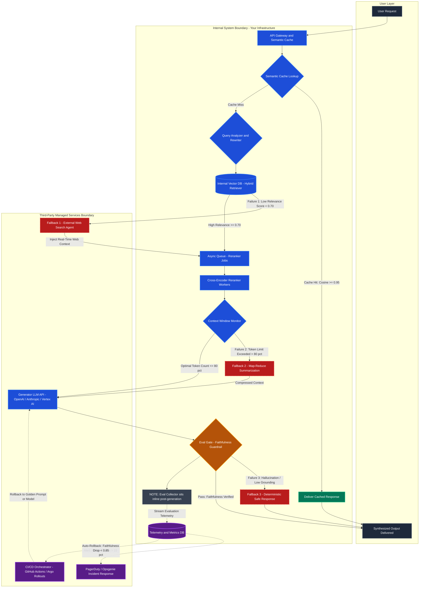

# Advanced RAG System Architecture: Reliability, Scaling & Guardrails

> **Day 8 Assignment Deliverable (Foundational + Advanced)** — Resilient Multi-Stage RAG Pipeline with clear System Boundaries, 3 Circuit Breakers, Decoupled GPU Reranking, and Continuous Evaluation Rollback.

---

## Deliverable A — Pillar Choices (Day 8 Foundational)

For this enterprise knowledge assistant, we selected **Retrieval-Augmented Generation (RAG)** and **Continuous Evaluation & Guardrails** as our two primary pillars. RAG is required because enterprise documentation updates dynamically and demands deterministic grounding without costly retraining. Continuous Evaluation & Guardrails are essential because user-facing accuracy requires real-time hallucination prevention and automated rollback triggers to maintain strict regulatory compliance.

---

## Deliverable B — Most Critical Failure Point & Mitigation (Day 8 Advanced)

The most critical failure point is an **ungrounded hallucination bypassing the evaluation guardrail**, which directly damages institutional credibility and user trust in mission-critical applications. To mitigate this, the architecture enforces a deterministic citation-grounding validation layer where every generated statement must bind to explicit retrieved chunk IDs verified via Natural Language Inference (NLI) and regex pattern matching before rendering. Any draft failing this strict threshold is intercepted before rendering and replaced by a deterministic, pre-approved safe response: *"I cannot verify this information based on the available data."*

---

## Full System Architecture Diagram

> All node labels with parentheses are wrapped in double quotes as required by GitHub Mermaid.

---

## System Boundary Breakdown

| Environment | Component | Role |
|---|---|---|
| **Internal (Yours)** | API Gateway & Semantic Cache | Edge termination, rate limiting, Redis similarity cache |
| **Internal (Yours)** | Query Analyzer & Rewriter | Query decomposition and vector query rewriting |
| **Internal (Yours)** | Vector DB / Hybrid Retriever | Dense ANN + BM25 sparse similarity search |
| **Internal (Yours)** | Async Reranker Queue & Workers | Decoupled GPU worker pool for Cross-Encoder reranking |
| **Internal (Yours)** | Context Window Monitor | Pre-inference token counter blocking context overflow |
| **Internal (Yours)** | Eval Gate & Eval Collector | Inline NLI faithfulness scoring before user delivery |
| **Internal (Yours)** | Telemetry & Metrics DB | Prometheus / ClickHouse tracking refusal & quality drift |
| **Third-Party (External)** | External Web Search Agent | SerpAPI / Tavily fetching real-time fallback context |
| **Third-Party (External)** | Generator LLM API | Hosted endpoint: OpenAI / Anthropic Claude / Vertex AI |
| **Third-Party (External)** | PagerDuty / Opsgenie | On-call incident alerting for anomaly spikes |
| **Third-Party (External)** | CI/CD Orchestrator | GitHub Actions / Argo Rollouts managing rollback webhooks |

---

## 3 Identified Failure Points with Explicit Fallback Behaviors

### Failure Point 1 — Retriever Failure (Low Relevance / Empty Set)
- **Detection:** Vector similarity scores below `0.70`, or empty result set.
- **Impact without fallback:** Model hallucinates with high confidence from irrelevant chunks.
- **Fallback:** Route query to an **External Web Search Agent** (SerpAPI / Tavily). Dynamically embed fetched web documents and inject into the reranker queue — session continues without interruption.

### Failure Point 2 — Context Window Overflow
- **Detection:** Accumulated tokens (system prompt + history + chunks) exceed `80%` of model context limit.
- **Impact without fallback:** HTTP 400 API crash or silent truncation of critical instructions.
- **Fallback:** Middleware triggers **Map-Reduce Summarization** via a fast lightweight model (Gemini Flash / Claude Haiku). Chunks are compressed 60–75% through Map (per-chunk propositions) then Reduce (consolidated summary), preserving chunk IDs.

### Failure Point 3 — Eval Gate Rejection (Hallucination)
- **Detection:** NLI Faithfulness Judge scores the draft below `0.85` — ungrounded claims detected.
- **Impact without fallback:** False or fabricated information reaches the user, destroying trust.
- **Fallback:** Draft is discarded. User receives the deterministic safe response: *"I cannot verify this information based on the available data."* Failed pair is queued for RLHF analysis.

---

## Scaling Consideration — The Reranker Bottleneck

**First bottleneck: Cross-Encoder Reranker**

Unlike Bi-Encoders (pre-computed vectors, sub-ms ANN lookup), a Cross-Encoder passes query + document pairs through full bidirectional cross-attention — O(K * L^2) complexity. At 500+ QPS with 50 candidates per request, GPU VRAM saturates and the async event loop blocks.

**Mitigation:**
1. **Decouple via Async Queue** — Offload reranking to a Redis/Celery worker cluster with KEDA autoscaling on GPU nodes based on queue depth.
2. **Semantic Front-End Cache** — Redis / GPTCache in front of the API Gateway. Queries with cosine similarity >= 0.95 against cached queries return in < 15ms with zero GPU cost.
3. **Two-Stage Cascade** — BM25 pre-filters 100 candidates to top 15 before the Cross-Encoder runs.

---

## Eval Integration — How Metrics Trigger Alerts and Rollbacks

**Where the Eval Collector sits:** Inline between the Generator LLM and the final output gate. Every response is scored *before* reaching the user.

**Metrics tracked (async telemetry stream to Prometheus / ClickHouse):**
- Faithfulness Score (NLI-grounded claim ratio)
- Answer Relevance (cosine similarity of query vs. response)
- Refusal Rate (proportion of safe-response fallbacks triggered)
- P99 Latency and Token Consumption

**Alert Trigger — Goodhart's Law Detection:**
- Condition: Refusal Rate moving average spikes > 15% over a 15-minute window while Faithfulness stays near 1.0 (system is being over-conservative).
- Action: PagerDuty P1 incident fires, on-call engineers recalibrate guardrail thresholds.

**Auto-Rollback Trigger — Quality Regression Guard:**
- Condition: Rolling 100-request Faithfulness average drops below `0.85`, or hallucination rate exceeds `5%`, following a deployment.
- Action: Telemetry analyzer fires an authenticated webhook to the CI/CD orchestrator (GitHub Actions / Argo Rollouts). Zero-downtime rollback to the last Golden Model / Prompt Template version. Failed run is auto-exported to an evaluation regression dataset.
