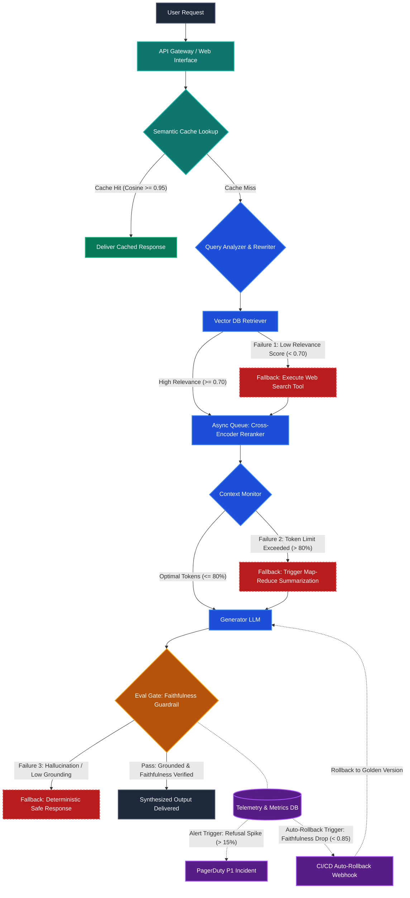

# Day 8 Assignment Submission Guide

Use this document to submit your deliverable in the guided project workspace.

---

## 📋 Deliverable 1: 2–3 Sentences on the Most Critical Failure Point and Mitigation

> **The most critical failure point is an ungrounded hallucination bypassing the evaluation guardrail, which directly damages institutional credibility and user trust.** To mitigate this, the architecture enforces a deterministic citation-grounding validation layer where generated statements must link to explicit retrieved chunk IDs verified via Natural Language Inference (NLI) and regex pattern matching. Any output failing this strict threshold is intercepted before rendering and replaced by a deterministic, pre-approved safe response (`"I cannot verify this information based on the available data."`).

---

## 📊 Deliverable 2: Updated Mermaid Architecture Diagram



---

## 🛠️ Step-by-Step GitHub Submission Instructions

To push this repository to GitHub and submit your link:

1. **Create a new repository** on GitHub (e.g. `day8-advanced-architecture` or `rag-advanced-architecture`).
2. Run the following terminal commands in the project folder (`C:\Users\Naman\Desktop\day8_advanced_architecture`):
   ```bash
   git init
   git add .
   git commit -m "feat: complete Day 8 advanced architecture with fallbacks, scaling, and rollback mechanics"
   git branch -M main
   git remote add origin https://github.com/<YOUR_GITHUB_USERNAME>/day8-advanced-architecture.git
   git push -u origin main
   ```
3. Copy the URL of your new GitHub repository:
   `https://github.com/<YOUR_GITHUB_USERNAME>/day8-advanced-architecture`
4. Paste the URL into the guided project workspace submission field to earn your **5 points**!
